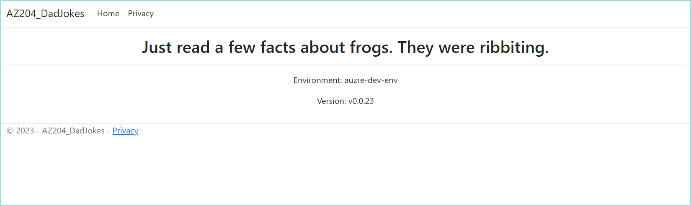
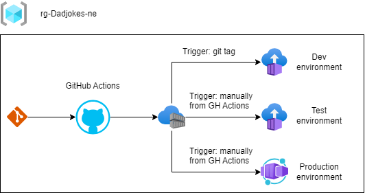

# AZ204-DadJokes

> Project created in purpose to learn some things needed to pass AZ-204 exam.  
> Simulation of environments for developers, QAs and one production environment.

## Technologies used

I created the ASP.NET Core Web Application. The app is very simple: show random Dad Jokes and that's all :)



The joke is written using large font. Under that information on which environment this app is deployed. And then are the app version.
That's all the features :)

What I used to do this:
- **Azure Container Registry (ACR)** to store my app Docker images
- **Azure Container Instance (ACI)** to deploy my apps. One ACI is used as **dev** environment, another as **test** environment
- **Azure Container Apps** as production environment.
- **GitHub Actions** to do all the work: prepare Docker image, publish it to ACR, deploy image to one of three environments:



All **Github Actions files** are in [.github/workflows](https://github.com/tomaszprasolek/AZ204-DadJokes/tree/master/.github/workflows) folder.  

I also prepared **Azure Bicep scripts** to be able to very easily create all working environment from scratch.
Bicep files are here: [AZ204-DadJokes/Bicep](https://github.com/tomaszprasolek/AZ204-DadJokes/tree/master/AZ204-DadJokes/Bicep).

## How to set up the environment on Azure
1. Create resource group when all other Azure resource will be placed
2. Get your principal identifier from Azure, it is needed for the next script. You can find it: Users >> your user >> Object Id. It is need to add your user the `Contributor` role to Azure Container Registry (ACR).
3. Run `main.bicep` script (AZ204-DadJokes/Bicep/main.bicep) and pass `Object Id` as parameter.
4. Command to run Bicep script: `az deployment group create --resource-group rg-Dadjokes-ne --template-file .\AZ204-DadJokes\Bicep\main.bicep --parameters parPrincipalId='your-object-id'`. **Remember changing the resource group name and principal id.**
5. In that moment you should have **Azure Container Registry created on the Azure**.
6. Copy password from ACR (ACR >> Settings >> Access Keys >> password) to Github repository secrets (Settings >> Security >> Secret and variables >> Actions) to `ACR_PASSWORD` field.
7. Run command `az ad sp create-for-rbac --name DadJokesRG-ServicePrincipal --role contributor --scopes /subscriptions/#your-subsciption-guid#/resourceGroups/rg-Dadjokes-ne --sdk-auth`. This command will generate the JSON with credentials to the Azure. You need this to able Github to login into Azure.  
   
    1. Scope you can get from your resource group, click `JSON view` in Overview tab and the `id` field it will be that scope.
    2. The generated JSON you need to copy to Github repository secrets (Settings >> Security >> Secret and variables >> Actions) to `AZURE_CREDENTIALS_V2`
     
8. Now you can publish docker image to Azure Container Registry. There are 2 options:  
    
    1. Push new tag to your Git repository, this will trigger the Github Action which publish docker image to ACR.
    2. Run `AZ204-DadJokes/Bicep/containerInstance.bicep` script. This script requires 2 parameters: environment type and version. To run this you can use command `

## Links:

Azure Container Registry:
- https://brendanthompson.com/posts/2022/02/using-github-actions-to-publish-container-images-to-azure-container-registry
- https://thomasthornton.cloud/2022/12/14/build-and-push-docker-image-to-azure-container-registry-using-github-action/

Portal Azure:
- https://learn.microsoft.com/en-us/answers/questions/1369827/(solved)-status-401-unauthorized-shows-in-the-repo
- https://learn.microsoft.com/en-us/cli/azure/authenticate-azure-cli-service-principal
- https://learn.microsoft.com/en-us/cli/azure/azure-cli-sp-tutorial-1?tabs=bash

Github Actions:
- https://github.com/marketplace/actions/get-latest-tag
- https://github.com/actions/runner/issues/1413#issuecomment-1197936320

Azure Bicep links:
- https://www.youtube.com/watch?v=VDCAJIGqHZU&pp=ygULYXp1cmUgYmljZXA%3D
- https://www.youtube.com/watch?v=atWVFV7Y4vY
- https://johnlokerse.dev/2023/09/11/azure-bicep-tips-tricks/
- https://www.thorsten-hans.com/how-to-deploy-azure-container-apps-with-bicep/
- https://stackoverflow.com/questions/72044477/creating-container-registry-from-azure-bicep-and-deploying-image-to-this-registr
- https://www.serverlessnotes.com/docs/deploy-azure-container-apps-using-bicep

Git:
- https://jflower.co.uk/removing-sensitive-information-from-git-with-git-filter-repo/

## Azure Commands

Create Azure Container Instance, get image from Azure Container registry.
```
az container create \
    --resource-group az204-dadjokes-rg \
    --name devdadjokes \
    --image acrdadjokespc.azurecr.io/dadjokes:v0.0.3
    --restart-policy OnFailure \
    --environment-variables 'RunningEnvironment'='dev_azure' \
    --ports 80 \
    --dns-name-label tomotest \

az container create --resource-group az204-dadjokes-rg --name devdadjokes --image acrdadjokespc.azurecr.io/dadjokes:v0.0.3 --restart-policy OnFailure --environment-variables RunningEnvironment=dev_azure --ports 80 --dns-name-label tomodadjokes --registry-username SECRET --registry-password SECRET
```

Generates the Azure credentails that can be used to login to Azure from Github Actions
```
az ad sp create-for-rbac --name DadJokesRG-ServicePrincipal --role contributor --scopes /subscriptions/***REMOVED***/resourceGroups/az204-dadjokes-rg --sdk-auth
```

Run Azure Bicep script
```
az deployment group create --resource-group rg-Dadjokes-ne --template-file containerApps.bicep --parameters parVersion='v0.0.16'
```

Create managed environment needed to Azure Container Apps
```
az containerapp env create --name acaEnvDadjokesNe --resource-group rg-Dadjokes-ne --location northeurope
```
